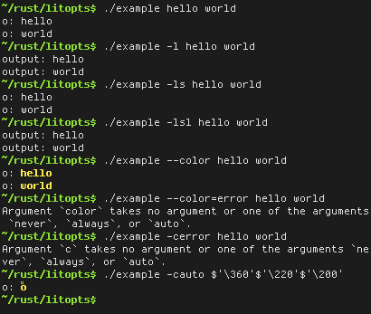

## litopts

Command line option parsing.

### Short description

litopts allows you to specify possible command line options in a convenient way,
parse arbitrary posix style (-a) and --gnu-style options, and iterate over them
in the order the appeared in the command line.

### Details

The following example contains all possible option forms (modulo whitespace and
renaming):
```rust
static OPTS: libopts::Opts = litopts! {
    "-a",
    "--bbbb",
    "-c, --cccc",
    "-d <ARG>",
    "--eeee=ARG",
    "-f, --ffff=ARG",
    "-g[ARG]",
    "--hhhh[=ARG]",
    "-i, --iiii[=ARG]",
};
```
In the stream of command line options, these translate to the following variants:

Short | Long
----- | ---
`OptFlag('a')` | 
             | `OptLongFlag("bbbb")`
`OptFlag('c')` |
`OptOpt('d', v)` |
               | `OptLongOpt("eeee", v)`
`OptOpt('f', v)` |
`OptOptOpt('g', v)` |
                  | `OptLongOptOpt("hhhh", v)`
`OptOptOpt('i', v)` |

Note that litopts always chooses the shorter variant if possible.

Other possible variants are

Variant | Description
---|---
`OptMissing(c)` | Missing argument to a short option.
`OptLongMissing(s)` | Missing argument to a long option.
`OptUnknown(c)` | Unknown flag in a series of flags, e.g., in the example above consider the argument `-acx`. This would trigger `OptFlag('a')`, `OptFlag('c')`, and `OptUnknown('x')`.

In order to give helpful error messages, each parsed option in the stream comes
with the name that was actually used for it in the command line. E.g., in the
example above, `--cccc` triggers `OptFlag('c')` but it comes with a field
containing "cccc". See the example for details.

### Example

This program parses its arguments and writes each free argument to the command
line prefixed with `o: ` or `output: `, depending on the activated mode.
If colorization is enabled, it will print the argument in yellow.

```rust
#![feature(phase)]

#[phase(syntax)]
extern crate litopts_mac;
extern crate litopts;

use litopts::{OptFlag, OptOptOpt, OptLongFlag, OptFree, OptUnknown};

#[deriving(PartialEq, Eq)]
enum ColorMode {
    /// Never write colored text.
    Never,
    /// Always write colored text.
    Always,
    /// Write colored text if the output is a terminal.
    Auto,
}

fn main() {
    static OPTS: litopts::Opts = litopts! {
        "-c, --color[=WHEN]",
        "-s, --short",
        "-l, --long",
        "    --version",
    };

    let mut color_mode = Never;
    let mut short_mode = true;
    let mut free = Vec::new();

    let args = std::os::args_as_bytes();
    for o in OPTS.getopts(args.tail()) {
        match o.var {
            // Re-enable a previously disabled short mode.
            OptFlag('s') => short_mode = true,
            OptFlag('l') => short_mode = false,
            OptOptOpt('c', v) => {
                // Since the argument is optional, v in an Option<&[u8]>.
                match v {
                    Some(v) => match std::str::from_utf8(v) {
                        Some("never")  => color_mode = Never,
                        Some("always") => color_mode = Always,
                        Some("auto")   => color_mode = Auto,
                        _ => {
                            // o.real contains the string the option was activated with.
                            (writeln!(std::io::stderr(),
                                "Argument `{0}` takes no argument or one of the \
                                 arguments `never`, `always`, or `auto`.",
                                 o.real)).unwrap();
                            std::os::set_exit_status(1);
                            return;
                        }
                    },
                    None => color_mode = Always,
                }
            },
            OptLongFlag("version") => {
                println!("1.0.0");
                return;
            },
            OptFree(v) => free.push(v),
            OptUnknown(_) => { /* ignore this for now */ },
            // The other variants cannot appear.
            _ => unreachable!(),
        }
    }

    let mut stdout = std::io::stdio::stdout_raw();
    let colorize = (color_mode == Always) || (color_mode == Auto && stdout.isatty());

    for &f in free.iter() {
        if short_mode {
            stdout.write_str("o: ").unwrap();
        } else {
            stdout.write_str("output: ").unwrap();
        }
        if colorize {
            stdout.write(bytes!("\x1b[33;1m")).unwrap();
        }
        stdout.write(f).unwrap();
        if colorize {
            stdout.write(bytes!("\x1b[0m")).unwrap();
        }
        stdout.write_str("\n").unwrap();
    }
}
```


